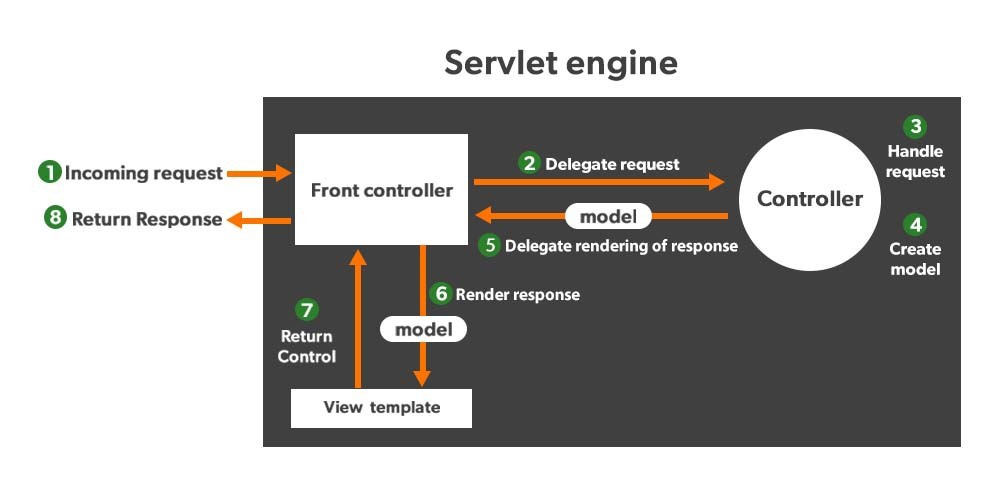

# Calculator Demo App
## Spring Boot Model-View-Controller (MVC)-Konzept
Trennung von Daten (Model), Präsentation (View) und Steuerung (Controller)

## FrontController
Front Controller: It remains responsible for managing the flow of the web application. 
DispatcherServlet acts as a front controller in Spring MVC.

### Model (Daten)
Model repräsentiert die Daten (Java-Objekte), die in Controllern erstellt oder aus Datenbanken oder anderen Datenquellen abgerufen werden. 
Diese Daten werden dann an die Mustache-Templates übergeben, um sie in den generierten HTML-Seiten anzuzeigen.

### View (Präsentation)
Die Mustache-Templates dienen als die "View" in diesem Kontext. 
Diese Templates enthalten HTML-Struktur und Mustache-Ausdrücke, die dazu verwendet werden, die dynamischen Daten aus dem Model in die HTML-Seiten einzufügen. 
Mustache-Tags wie {{name}} können verwendet werden, um auf Daten im Model zuzugreifen und sie in der HTML-Ausgabe anzuzeigen.

### Controller (Steuerung)
Controller: Verarbeitung von Benutzeranfragen verantwortlich und Steuerung, welche Daten dem Model hinzugefügt werden und welches Mustache-Template gerendert wird. 
Die Controller sind in der Regel mit Annotationen wie @Controller gekennzeichnet und definieren Methoden, die auf bestimmte URLs reagieren. 
Diese Methoden verwenden das Model, um Daten vorzubereiten, und geben dann den Namen des Mustache-Templates zurück, das gerendert werden soll.

```
@GetMapping("/")
fun blog(model: Model): String {
   model["title"] = properties.title
   return "calculator"
}
```
## Technologies
Spring Boot Framework: Webanwendung, RESTful APIs, Spring Security, ...
Auslieferung als JAR (javaArchive), dies kann einfach deployed werden.

## Gradle 
Automatisierung des Build- und Entwicklungsprozesses. 
`gradle build` baut das Projekt, lädt Abhängigkeiten und kompiliert Code.
`gradle bootRun` von Gradle ermöglicht das einfache Starten der Spring Boot-Anwendung direkt aus dem Quellcode, ohne vorher ein JAR-Archiv erstellen zu müssen.

## Kotlin
Kotlin ist eine moderne, statisch typisierte Programmiersprache, die auf der Java Virtual Machine (JVM) läuft.

## Mustache
Mustache HTML Templates, Trennung von HTML-Struktur und Daten

## Database
H2 Database ist eine In-Memory-Datenbank, benötigt geringe Resourcen.